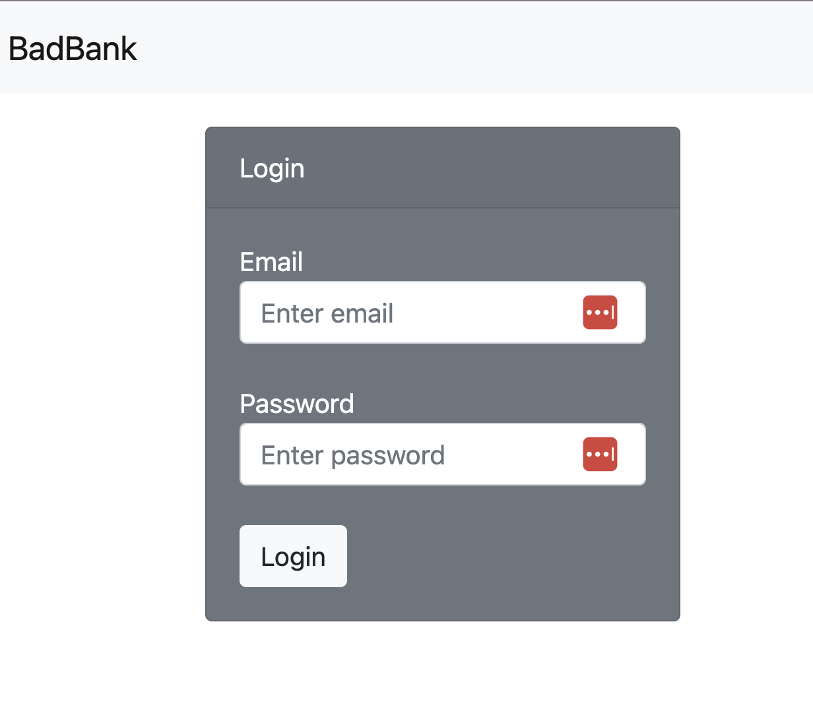
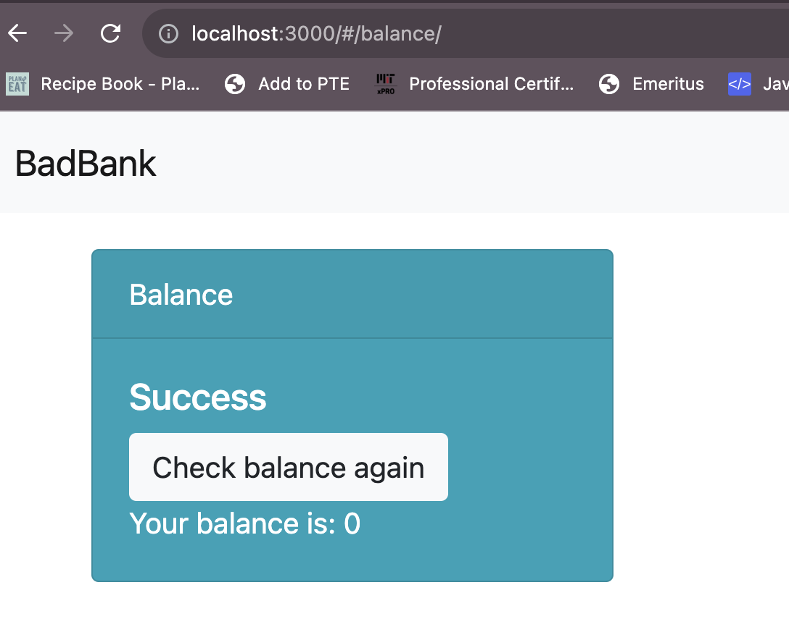

# Bad Bank Application

## Description

MIT XPRO Full Stack Project. Demostrates the skills learned over the course and applied to a fully functional banking application.

## Instalation guide:

- Clone repo
- npm install
- Start MongoDB
- npm start

## Users can create new accounts, login, check their balance and view all the accounts that have been

- Create a new account
  
- Check your Balance
  
  Veiw the accounts that have been created
  

### Tech Stack

- React.js
- Node.js with Express
- MongoDB with Mongoose
- Bootstrap
- Docker

## Features

- Create Account and All Data displays working smoothly
- Fully functional backend to track data
- Bootstap Card and Navbar Styling

## Future Improvements

- Add Show/ Hide password toggle option
- Add More Functionality to Admin Role for Adding additional users manually

# MIT License

Copyright (c) 2023 Airiel Altemara

Permission is hereby granted, free of charge, to any person obtaining a copy of this software and associated documentation files (the "Software"), to deal in the Software without restriction, including without limitation the rights to use, copy, modify, merge, publish, distribute, sublicense, and/or sell copies of the Software, and to permit persons to whom the Software is furnished to do so, subject to the following conditions:

The above copyright notice and this permission notice shall be included in all copies or substantial portions of the Software.
